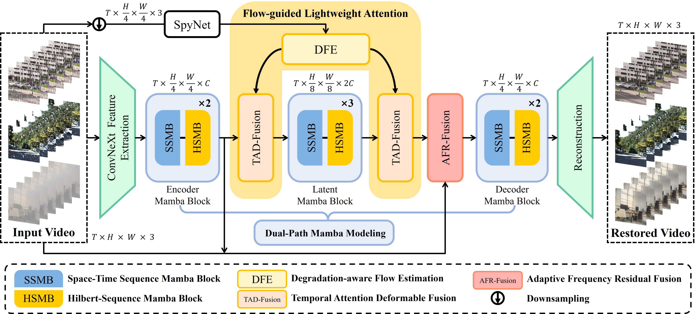

# FLAME: Flow Guidance and Adaptive Frequency Fusion for All-in-One Mamba-Enhanced Video Restoration

> Official PyTorch implementation of **FLAME** (IEEE TIP, under review).

**FLAME: Flow Guidance and Adaptive Frequency Fusion for All-in-One Mamba-Enhanced Video Restoration**
<br>
[Zhizhou Lu](https://github.com/StephenLockhart)\*, Tianrui Liu\*, Jun-Jie Huang†, Wentao Zhao, Xinwang Liu, Wenhan Luo, and Meng Wang
<br>
National University of Defense Technology; HKUST; Hefei University of Technology
<br>
(\* equal contribution, † corresponding author: jjhuang@nudt.edu.cn)

---

## 📖 Introduction

All-in-One video restoration under adverse weather conditions (e.g., rain, snow, haze) remains challenging: explicit optical flow alignment becomes unreliable under heavy degradations, while implicit sequence modeling lacks fine-grained temporal correspondence. **FLAME** synergistically combines both paradigms through three core components:

1. **Dual-Path Mamba Modeling (DPMM)** — complementary Space-Time Sequence Mamba (STSM) and Hilbert-Sequence Mamba (HSMB) blocks for efficient spatiotemporal modeling with linear-complexity scanning;
2. **Flow-guided Lightweight Attention (FLA)** — Degradation-aware Flow Estimation (DFE) with triple quality assessment, plus Temporal-spatial Attention Deformable (TAD) fusion with Adaptive Fusion Strength (AFS);
3. **Adaptive Frequency Residual Fusion (AFR)** — learnable frequency decomposition with Instance Normalization front-end, Adaptive Mask Generation (AMG) and cross-channel attention for degradation-specific spectral enhancement.

<p align="center">

</p>

This repository extends our conference version **AIM-VR** (ICME 2025) with the FLA mechanism, the upgraded AFR module, and broader benchmark coverage. The AIM-VR codebase is available at [StephenLockhart/AIM-VR](https://github.com/StephenLockhart/AIM-VR).

## 📊 Results

| Dataset | Task | FLAME (Ours) | Previous SOTA | Gain |
|---|---|---|---|---|
| VRDS | rain streak + raindrop removal | **35.50 dB PSNR** | RainMamba 32.04 dB | **+3.46 dB** |
| LWDDS | windshield waterdrop removal | **40.17 dB PSNR** | RainMamba 37.21 dB | **+2.96 dB** |
| W3 | all-in-one multi-weather | **31.04 dB PSNR** | AIM-VR 30.45 dB | **+0.59 dB** |
| RainSynAll100 (rain-haze) | rain-haze mixture removal | **29.00 dB PSNR** | BasicVSR++ 27.67 dB | **+1.33 dB** |

Please refer to the paper for full comparison and ablation tables.

## 🛠️ Installation

Tested environment: Python 3.10+, PyTorch 2.7.0 (CUDA 12.8), MMCV 2.x, MMEngine 0.10.5.

```bash
# 1. Create environment
conda create -n flame python=3.10 -y
conda activate flame

# 2. Install PyTorch (adjust CUDA version to your driver)
pip install torch==2.7.0 torchvision --index-url https://download.pytorch.org/whl/cu128

# 3. Install OpenMMLab runtime
pip install -U openmim
mim install "mmcv>=2.0.0" "mmengine==0.10.5"

# 4. Install minimal dependencies for FLAME
pip install einops opencv-python Pillow numpy requests tensorboard matplotlib lpips

# 5. Install this repository
git clone https://github.com/StephenLockhart/FLAME.git
cd FLAME
pip install -e .
```

> The full upstream dependency list is in `requirements/runtime.txt` — it is only needed if you plan to use other models shipped with the framework. FLAME itself only needs the packages above.

## 🚀 Quick Start

### 1. Download pretrained weights

| File | Size | Description |
|---|---|---|
| `flame_rainsynall100haze_psnr.pth` | 308 MB | Main model, EMA weights (RainSynAll100 rain-haze, measured 29.52 dB PSNR / 0.9614 SSIM), `DMVRTNetFixed160` |
| `flame_rainsynall100haze_ssim.pth` | 308 MB | SSIM-oriented checkpoint of the same model |
| `flame_rainsynall100.pth` | 170 MB | RainSynAll100 (rain only), `DMVRTNetFixed128` |

Weights are distributed in a compact inference-only format (EMA generator weights, optimizer states removed, ready to be loaded by the MMagic wrapper).

Download from **HuggingFace**: `https://huggingface.co/StephenLockhart/FLAME` (TODO: link will be activated upon release) or **Baidu Netdisk**: (TODO: link + extraction code).

Place the weights under `checkpoints/`:

```bash
mkdir checkpoints
# e.g. put flame_rainsynall100haze_psnr.pth into ./checkpoints/
```

> **Auxiliary weights handled automatically:** the SpyNet optical-flow estimator and the ConvNeXt-Tiny feature encoder are downloaded automatically on first use (or you may place `spynet_sintel_final-3d2a1287.pth` manually under `~/.cache/flame/checkpoints/`). VGG16 (perceptual loss, training only) is fetched via torchvision.

### 2. Prepare the dataset

Download **RainSynAll100** from the source released by its authors (RMFD, TPAMI 2022) and organize it as:

```
data/RainSynAll100/
└── Video_rain_synthesis_test/
    ├── GT/          # e.g. GT/0900/1.jpg ... (frames numbered from 1)
    └── Rain_Haze/   # degraded input with the same folder/file layout
```

Other benchmarks used in the paper: **VRDS** (VIMPNet, ACM MM 2023), **LWDDS** (VWR, arXiv:2302.05916), and **W3** (introduced by [AIM-VR, ICME 2025](https://doi.org/10.1109/ICME59968.2025.11209023)) — please obtain them from the respective original papers. See `configs/aimvrtRain/` for the expected directory layout of each.

### 3. Run inference / evaluation

Each checkpoint pairs with the matching test config:

```bash
# RainSynAll100 rain-haze (main result, DMVRTNetFixed160)
python tools/test.py \
    configs/aimvrtRain/test/dmvrt-fixed-64a32_f256_RainSynAll100Haze_Test.py \
    checkpoints/flame_rainsynall100haze_psnr.pth

# RainSynAll100 rain only (DMVRTNetFixed128)
python tools/test.py \
    configs/aimvrtRain/test/dmvrt-fixed-64a32_f128_RainSynAll100_FullTest_20250919.py \
    checkpoints/flame_rainsynall100.pth
```

Restored frames and PSNR/SSIM metrics will be saved under `./work_dirs/test/`. Before running, edit the config's `data_root` entry to point to your local dataset.

> Weights were converted from raw training checkpoints with
> `python tools/model_converters/convert_flame_ckpt.py <raw.pth> <clean.pth>`.

### 4. Training

```bash
python tools/train.py \
    configs/aimvrtRain/dmvrt-fixed-64a32_f256v48g8dp2-p160_lr1e-4_RainSynAll100Haze_20250924.py
```

The training config uses Charbonnier loss + VGG16 perceptual loss, AdamW (lr 1e-4) with linear warm-up and cosine restarts, EMA weights, and 300K iterations. Set `data_root` in the config first. WandB logging is available but disabled by default (see the commented `WandbVisBackend` block).

## 🗂️ Code Structure

FLAME is implemented on top of the [MMagic](https://github.com/open-mmlab/mmagic) framework. The FLAME-specific code lives in:

```
mmagic/models/editors/
├── aimvrt/                     # FLAME model (registered names kept as-is)
│   ├── dmvrt_net_fixed.py      # FLAME main network: DPMM + FLA + AFR
│   ├── dmvrt_net_fixed_128.py  # 128-channel / 128-patch variant
│   ├── dmvrt_net_fixed_160.py  # 160-patch variant (main paper model)
│   ├── aimvrt.py               # MMagic wrapper (training/inference pipeline)
│   ├── aimvrt_dynamic.py       # Dynamic Hilbert pipeline wrapper
│   └── VRT-main/models/network_vrt.py  # VRT building blocks (SpyNet, DCNv2, TRSA)
└── aimvsr/                     # AIM-VR components reused by FLAME
    ├── aimvr_net.py            # AIM-VR feature extractor (DPMM + frequency modules)
    └── modules/                # ConvNeXt encoder, Mamba blocks, Hilbert3d, etc.
```

Training/testing configs: `configs/aimvrtRain/`.

## 🎓 Citation

If you find this work useful, please cite:

```bibtex
@misc{flame2026,
  title  = {FLAME: Flow Guidance and Adaptive Frequency Fusion for All-in-One Mamba-Enhanced Video Restoration},
  author = {Lu, Zhizhou and Liu, Tianrui and Huang, Jun-Jie and Zhao, Wentao and Liu, Xinwang and Luo, Wenhan and Wang, Meng},
  year   = {2026},
  note   = {Manuscript under review at IEEE Transactions on Image Processing}
}

@inproceedings{aimvr,
  author    = {Lu, Zhizhou and Liu, Tianrui and Chen, Zihan and Huang, Junjie and Li, Xueqiong and Xiao, Baili and Zhao, Wentao},
  title     = {AIM-VR: All-in-One Video Restoration via Dual-Path Mamba with Frequency Adaptive Fusion},
  booktitle = {2025 IEEE International Conference on Multimedia and Expo (ICME)},
  pages     = {1--6},
  year      = {2025},
  doi       = {10.1109/ICME59968.2025.11209023}
}
```

## 🙏 Acknowledgement

This project is built upon [MMagic](https://github.com/open-mmlab/mmagic). The flow-guided attention modules reuse components from [VRT](https://github.com/JingyunLiang/VRT) (SpyNet, TRSA, DCNv2), the Hilbert scanning follows [gilbert](https://github.com/jakubcerveny/gilbert), and the Mamba blocks are built on [mamba_ssm](https://github.com/state-spaces/mamba) and [timm](https://github.com/huggingface/pytorch-image-models). We thank all the authors for their excellent open-source work. A complete provenance list with per-component licenses is maintained in [THIRD_PARTY_NOTICES.md](THIRD_PARTY_NOTICES.md).

## 📄 License

- The FLAME code and the MMagic-based portions of this repository are released under the [Apache License 2.0](LICENSE).
- **Exception:** `mmagic/models/editors/aimvrt/VRT-main/` is adapted from VRT and is licensed under **CC BY-NC 4.0 (non-commercial research use only)** — see its `LICENSE` file and [THIRD_PARTY_NOTICES.md](THIRD_PARTY_NOTICES) for details.
- The pretrained FLAME/SpyNet checkpoints are released for **non-commercial academic research** use.
